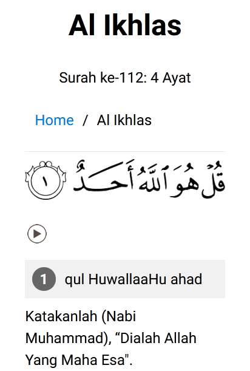
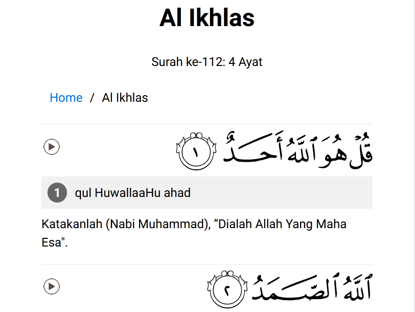

# playlits-surah-quran
Playlists audio Surah Al Fatihah, Al Falaq, An Naas, Al Ikhlas, Al Baqarah Ayat 255 (Ayat Kursi), dan Al Baqarah Ayat 285 - 286 disertai transliterasi latin dan terjemahan.
## Preview

## Credits
https://www.dhiwise.com/post/step-by-step-guide-to-creating-an-html-music-player
### Gambar Ayat Al Quran dan Audio
[https://everyayah.com/](https://everyayah.com/)
### Reciter
Alafasy
### Terjemahan
Al Quran Kementerian Agama Edisi Tahun 2019
